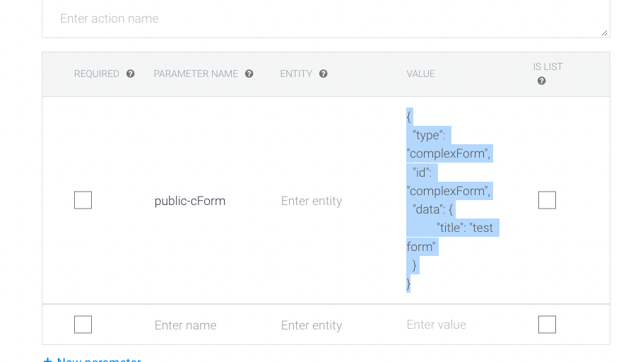
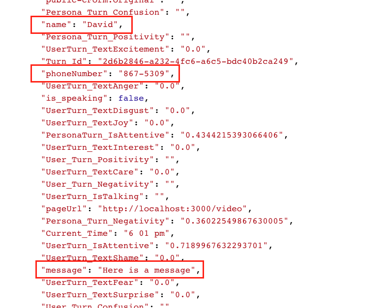

# Creating complex forms

When building conversations for your digital person, there may be places in the conversation where it makes sense to have a form input for user information. Our custom UI react reference template allows for developers to build custom components to include forms in the conversation, however capturing and sending each of those form fields to the NLP platform of choice may not be immediately apparent. This guide is to serve as a simple example of how you can capture and store form information in the conversation context.

## Steps
1. Modify the redux store to save form data.
2. Create the form component to update conversation context.

## Modify the redux store

If you look at the `Options` component in the React Reference UI, there is a `sendTextMessage` method that is imported from the redux store which is used to send each button option's defined text as a message from the user. Using the `sendTextMessage` method as an example, we will first create a `sendFormMessage` method that will mimic the same functionality while allowing us to include form details in the conversation context.

In the redux store (`./src/store/sm/index.js`), locate the `sendTextMessage` method and paste the following underneath it:
  ```js
  export const sendFormMessage = createAsyncThunk('sm/sendFormMessage', async ({ text, payload }, thunk) => {
    if (text === '') return thunk.rejectWithValue('submitted empty string!');
    if (scene !== null && persona !== null) {
      persona.conversationSetVariables(payload);
      persona.conversationSend(text);
      return thunk.dispatch(actions.addConversationResult({
        source: 'user',
        text,
      }));
    } return thunk.rejectWithValue('not connected to persona!');
  });
  ```

Our `sendFormMessage` is very similar to the `sendTextMessage` method. The one difference is that we are now including a `payload` parameter to be passed to the method, and sending that payload to the conversation context using the [`persona.conversationSetVariables(payload)`](https://docs.soulmachines.com/web-sdk/api/smwebsdk.persona.conversationsetvariables) method. 

Since we are already exporting the method in our function definition, we are now finished with modifying the redux store file and can move on to creating our `ComplexForm` component.

## Create the form component

For the purpose of this guide, I'm assuming a very simple JSON object being set in the NLU in order to demonstrate the form functionality. You may want to expand it to fit your specific needs, however we are assuming the content card payload to be in the following format:
```json
{
  "type": "complexForm",
  "id": "complexForm",
  "data": {
	  "title": "Complex form title"
  }
}
```


Here is an example of the `ComplexForm` component that you can use in your custom UI. As with any custom components, you'll need to include it in your `Components` directory and also import it into the `ContentCardSwitch` component. 

```js
import React, { useState } from 'react';
import { connect } from 'react-redux';
import PropTypes from 'prop-types';
import { sendFormMessage } from '../../store/sm/index';

function ComplexForm({ data, dispatchFormFromData }) {
  const { title } = data;
  const [name, setName] = useState('');
  const [phoneNumber, setPhoneNumber] = useState('');
  const [message, setMessage] = useState('');

  const handleSubmit = (e) => {
    e.preventDefault();
    const payload = {
      name,
      phoneNumber,
      message,
    };
    dispatchFormFromData('form submitted', payload);
  };

  return (
    <form onSubmit={handleSubmit}>
      { `Complex form: ${title}` }
      <input type="text" value={name} onChange={(e) => setName(e.target.value)} />
      <input type="text" value={phoneNumber} onChange={(e) => setPhoneNumber(e.target.value)} />
      <input type="text" value={message} onChange={(e) => setMessage(e.target.value)} />
      <input type="submit" value="Submit" />
    </form>
  );
}

ComplexForm.propTypes = {
  data: PropTypes.shape({
    title: PropTypes.string,
  }).isRequired,
  dispatchFormFromData: PropTypes.func.isRequired,
};

const mapDispatchToProps = (dispatch) => ({
  dispatchFormFromData: (text, payload) => dispatch(sendFormMessage({ text, payload })),
});

export default connect(null, mapDispatchToProps)(ComplexForm);
```

At a high level, this component provides text fields that are mapped to state values in this component. When the form component is submitted, we pass a user message (`form submitted` in this example) along with those state property values (as `payload`) into the `dispatchFormFromData` method defined in `mapDispatchToProps`.

When this message is sent, you will now be able to retrieve those values from the `soulmachines` context in whichever NLP service you are using. Example in Dialogflow ES:

