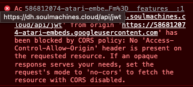
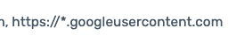

# Embedding DP Widget on Google Sites Domain

Google Sites web pages deployed with a Soul Machines Widget do not have a dependable originating URL that we are able to authorize when creating an API key in DDNAS. Simply adding a custom UI domain of `https://sites.google.com` to your configuration does not work, as Google seems to generate a random originating URL for the requests to our server.

> Domain prefix `586812074-atari-embeds` changes with page reload

To account for this issue, when whitelisting the domain you can insert a wildcard character (`*`) in place of that prefix.

ex: `https://*.googleusercontent.com`

This will enable requests from the google site to use your api keys.

> NOTE: It is not possible to wildcard all of a domain
